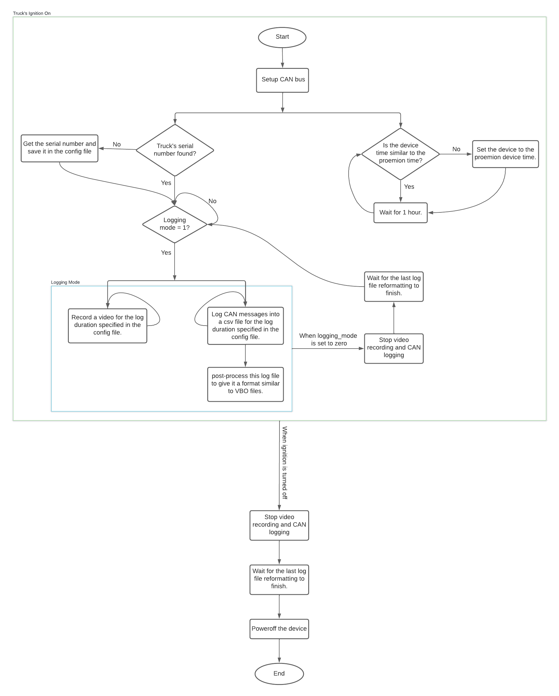

## Data Logging
Logs the videos and CAN signals and saves them as video-log_file pairs similar to the VBOX log files.


## File Overview
- [logging_controller.py](logging_controller.py): the main program that manages the CAN and video logging.  
- [watch_gpio_pin.sh](watch_gpio_pin.sh): the script that runs logging_controller.py and gracefully shuts down the device when ignition is turned off.
- [logging_config.yaml](logging_config.yaml): the config file that includes all the settings required to log data. 
- [can_logging/](can_logging): has the scripts that log CAN messages and post-process them to have a format like the VBO files. 
- [find_serial_number/](find_serial_number): contains the script that reads the serial number of the vehicle and saves it in the config file. 
- [set_device_time/](set_device_time): ensures the device time is synced with the Proemion time by setting it every hour if it drifts.   
- [video_recording/](video_recording): contains the gstreamer pipleine used to record videos and the python script that runs it.
- [startup_services/](startup_services): contains the systemd services that automate all the functions mentioned above.


### Systemd Services
[can_setup.service](startup_services/can_setup.service) - runs a shell script that **exports the GPIO pin 373** and sets CAN cummunication on can0.<br>
&darr;<br>
[setting_device_time.service](startup_services/setting_device_time.service) - runs a python script that sets the device time every hour if it drifts.<br>
[logging.service](startup_services/logging.service) - logs videos and CAN messages while logging_mode in the config file is equal to 1 and the truck's ingition is on.

```setting_device_time.service``` and ```logging.service``` require ```can_setup.service``` to run first with no errors. 


## Dependencies
Create a pyenv virtual environment with the name ```AIPY```. Inside this venv install the following packages:
* [python-can](https://pypi.org/project/python-can/) 
* [cantools](https://pypi.org/project/cantools/) 
* [yaml](https://pypi.org/project/PyYAML/) 
* [ruamel.yaml](https://pypi.org/project/ruamel.yaml/) 
* [pandas](https://pypi.org/project/pandas/)
* [numpy](https://pypi.org/project/numpy/)
* [opencv-python](https://pypi.org/project/opencv-python/)


## Autostartup
1. Copy the 3 services in `startup_services` to ```/etc/systemd/system```<br>
2. Grant each service the necessary permissions - ```chmod 644 service_file_name```  
3. Make the services run when the device is booted - ```systemctl enable service_file_name```  

 


## How it Works



## Key Notes 

* **Device space check**: before logging begins, the logging program checks if there is enough space on the device that data will be saved on, if not, it exits and will only restart after the syslogic is rebooted. This also happens everytime before starting a new log file, but in that case, the program waits until it post-processes the previous CAN log file before exiting. 

* **Logging delay**: logging only starts after the serial number is found, therefore, since the cycle time of the CAN message that sends the serial number is 3 seconds, it might take up to 3 seconds to start logging when logging for the first time the serial number is set.  

* **Max log file duration**: with the current setting, the log file duration must be less than or equal to **50 minutes**. To increase this length, the syslogic's hard shutdown interval must be increased so the log files have enough time to me reformatted before the device is powered off. 

* **Stop/start logging**: to automatically stop or start logging while the ```logging``` service is running, set the ```loggig_mode``` in the config file to 0 or 1, respectively, instead of stopping and starting the systemd service. 

* **Changing the settings**: any changes made to the settings in the config file (apart from changing the ```loggig_mode```) will be applied when a new logging session starts.

* **Log files time zone**: the time in the log files is GMT time because it is set by the Proemion. 

* **File overwrite**: if the logging is stopped and restarted in the same minute, the new videos and CAN log files overwrite the previous ones.

* **Service restart**: if the logging service fails, it is automatically restarted after 30 seconds.
 
 


 
 
